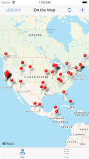
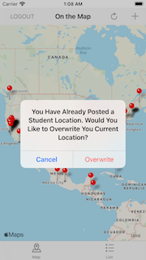
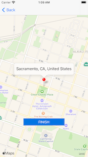

## On The Map

On the map is an app that allow the user to post his/her location into a map and a link. 

## Installation 

Clone the GitHub repository. 

`$ git clone https://github.com/ryepez/OnTheMap.git`

## Usage 

### Welcome Screen

### Map 

### Alert before posting  

### Enter location 

### Location Map

